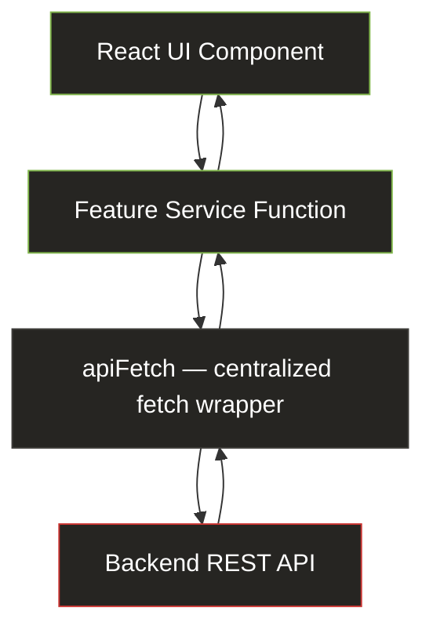
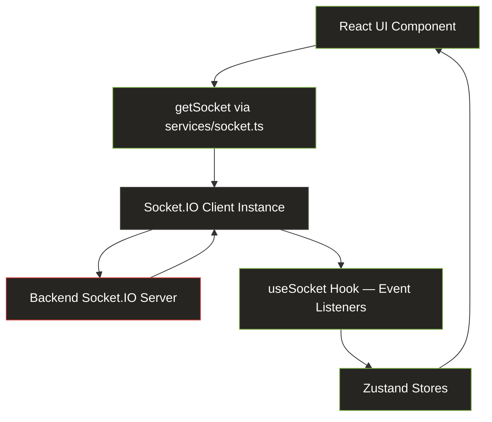
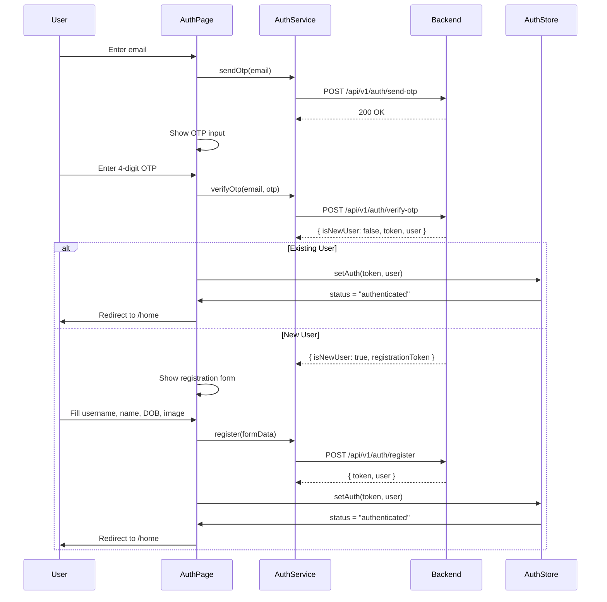
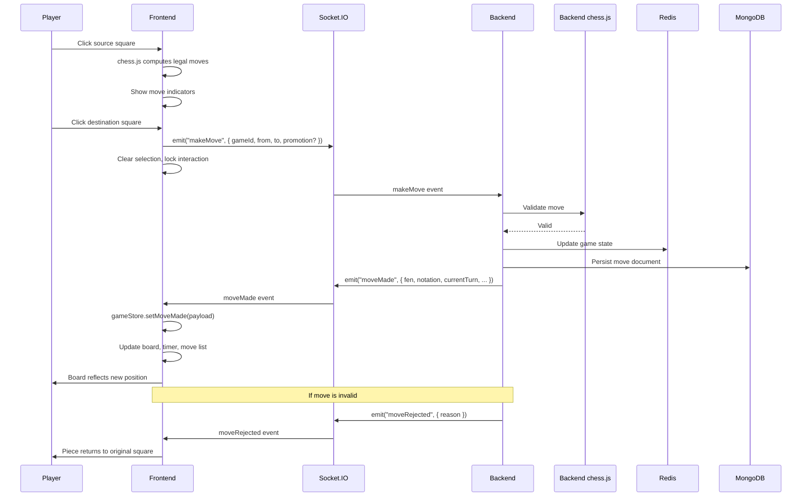
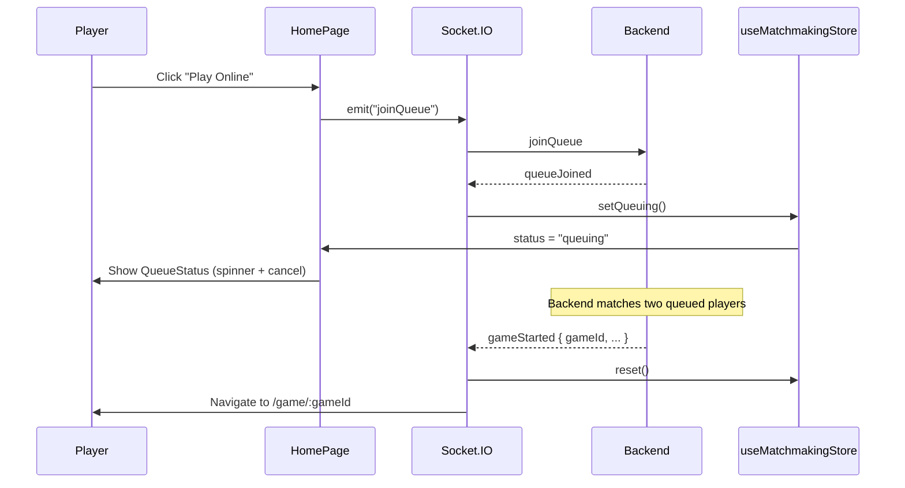
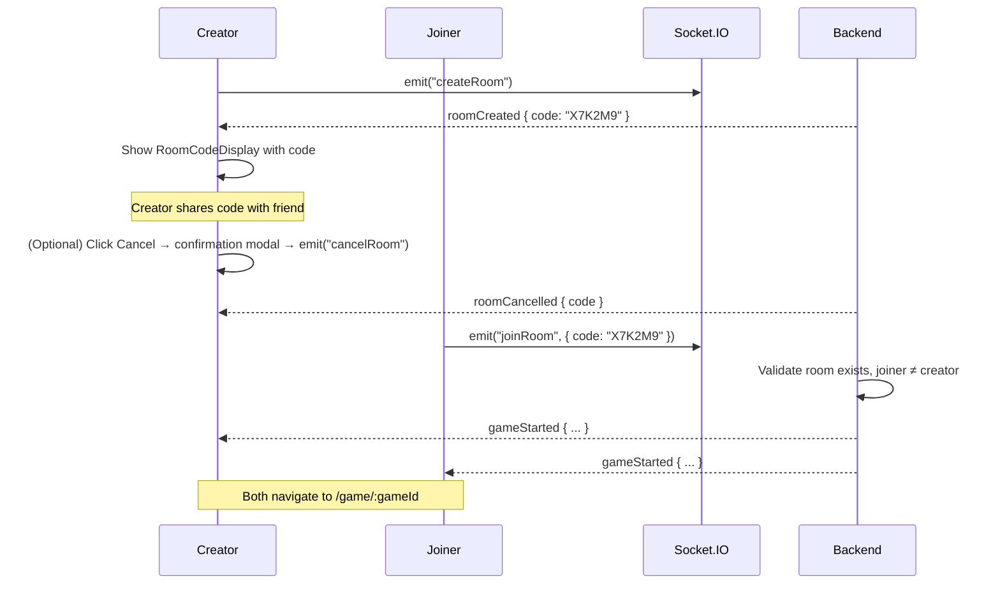

# Checkmate Frontend

A real-time multiplayer chess web application built with React 19, TypeScript, and Socket.IO. Players authenticate via email OTP, match against random opponents, friends (private rooms), or a server-side bot, then play full chess games with a 30-second-per-move timer — all validated and arbitrated by an authoritative backend.

---

## Table of Contents

1. [Project Overview](#1-project-overview)
2. [Technology Stack](#2-technology-stack)
3. [Frontend Architecture](#3-frontend-architecture)
4. [Folder Structure](#4-folder-structure)
5. [State Management Strategy](#5-state-management-strategy)
6. [API Architecture](#6-api-architecture)
7. [Authentication Flow](#7-authentication-flow)
8. [Real-Time Socket.IO Architecture](#8-real-time-socketio-architecture)
9. [Chessboard Implementation](#9-chessboard-implementation)
10. [Game State Flow](#10-game-state-flow)
11. [Timer Design](#11-timer-design)
12. [Matchmaking & Private Rooms](#12-matchmaking--private-rooms)
13. [Bot Mode](#13-bot-mode)
14. [Error Handling](#14-error-handling)
15. [Reconnection Strategy](#15-reconnection-strategy)
16. [Responsive & UI Design](#16-responsive--ui-design)
17. [Backend Integration Contract](#17-backend-integration-contract)
18. [Environment Configuration](#18-environment-configuration)
19. [Getting Started](#19-getting-started)
20. [Future Improvements](#20-future-improvements)

---

## 1. Project Overview

Checkmate is a two-player chess application where the backend is the single source of truth for all game state. The frontend is responsible for rendering the board, computing legal-move indicators via `chess.js`, collecting player input, and relaying it to the server over Socket.IO. Every move is validated server-side before it takes effect.

### Implemented Features

| Feature | Description |
|---|---|
| **OTP Authentication** | Email-based OTP login; new users complete a registration form (username, name, DOB, optional profile image) |
| **Home Screen** | Central hub with Play Online, Play Bot, Play with Friend, and Profile navigation |
| **Random Matchmaking** | FIFO queue — `joinQueue` pairs two players automatically |
| **Private Rooms** | Create a 6-character room code, share it, opponent joins via `joinRoom`; cancel with confirmation modal |
| **Play Against Bot** | Single button triggers a game against a server-side bot user (random legal moves) |
| **Real-Time Chess** | Custom-built 8x8 board with click-to-move, legal move dots, last-move highlighting, and check indication |
| **Pawn Promotion** | Modal with piece selection (Queen, Rook, Bishop, Knight) when a pawn reaches the back rank |
| **30s Turn Timer** | Per-turn countdown computed from the server's `turnStartedAt` timestamp; visual urgency at 10s and 5s |
| **Resignation** | Confirmation modal before emitting `resign` to the server |
| **Game End Overlay** | Non-dismissable result screen showing outcome (checkmate, resignation, timeout, draw) with Home/View Game actions |
| **Game History** | Paginated list of completed games on the profile page, with win/loss/draw badges and bot indicators |
| **Game Detail** | Full move table for any completed game, with opponent info and result summary |
| **Profile** | Displays user info with edit support: update name and DOB via modal, change profile photo by clicking avatar. Logout action. |
| **Opponent Disconnect Banner** | Warning banner when the opponent's socket drops mid-game |
| **Dark Mode** | Single dark theme — no light mode or theme toggle |
| **Responsive Layout** | Desktop side-by-side layout; mobile stacked layout with adaptive board sizing |

---

## 2. Technology Stack

| Technology | Version | Role |
|---|---|---|
| **React** | 19.1 | UI library — functional components with hooks |
| **TypeScript** | 5.8 | Static typing across all source files (strict mode enabled) |
| **Vite** | 6.3 | Dev server with HMR, production bundler (`tsc -b && vite build`) |
| **React Router** | 8.4 | Client-side routing with protected/public route guards |
| **Zustand** | 5.0 | Lightweight state management — three stores (auth, game, matchmaking) |
| **Socket.IO Client** | 4.8 | Bi-directional real-time communication for gameplay and matchmaking |
| **chess.js** | 1.4 | Chess rules engine for legal move computation and FEN parsing (frontend UX only — backend validates independently) |
| **Tailwind CSS** | 3.4 | Utility-first styling with a custom dark-theme token system |
| **PostCSS + Autoprefixer** | — | CSS processing pipeline for Tailwind |

**Notable absence:** There is no Axios dependency. REST calls use a thin wrapper around the native `fetch` API (`src/services/api.ts`), keeping the bundle lean and avoiding an extra dependency for straightforward request/response handling.

---

## 3. Frontend Architecture

The frontend enforces a strict separation between UI rendering, feature logic, and backend communication. No UI component directly imports the API client, constructs an endpoint path, or accesses the socket instance — each concern is handled by its own layer.

### REST API Data Flow



**Component** calls a feature service function (e.g., `listGames(page, limit)`) → the service function calls `apiFetch` with the endpoint path → `apiFetch` prepends the base URL, attaches the JWT `Authorization` header, handles errors → returns typed data.

### Real-Time Socket.IO Flow



**Components** emit events through `getSocket()?.emit(...)` → the single Socket.IO instance sends them to the backend → incoming events are handled by `useSocket` (mounted once in `AppLayout`) → the hook updates the appropriate Zustand store → React re-renders.

### Layer Responsibilities

| Layer | Location | Responsibility |
|---|---|---|
| **UI Components** | `src/feature/*/component/`, `src/component/ui/` | Render UI, capture user input, read from stores. Never import API/socket services directly beyond `getSocket()?.emit()` for fire-and-forget events. |
| **Feature Services** | `src/feature/*/service.ts` | Define endpoint paths and call `apiFetch`. One file per feature. |
| **API Client** | `src/services/api.ts` | Single `apiFetch` wrapper: base URL, auth header, error normalization, 401 handling. |
| **Socket Service** | `src/services/socket.ts` | Manages the Socket.IO connection lifecycle: `connectSocket(token)`, `getSocket()`, `disconnectSocket()`. |
| **Socket Event Hub** | `src/hooks/useSocket.ts` | Listens to all server-emitted events and dispatches to Zustand stores. Mounted once in `AppLayout`. |
| **Zustand Stores** | `src/store/`, `src/feature/*/store.ts` | Hold application state (auth, game, matchmaking). Updated by socket listeners or component actions. |
| **Feature Hooks** | `src/feature/*/hooks/` | Encapsulate feature-specific logic (e.g., `useChessGame` for board rules, `useTurnTimer` for countdown). |
| **Utilities** | `src/utils/` | Pure functions: square orientation, piece image mapping, date formatting, constants. |

---

## 4. Folder Structure

```
src/
├── feature/                          # Product features — self-contained modules
│   ├── auth/                         # OTP authentication + registration
│   │   ├── component/
│   │   │   ├── OtpSendForm.tsx       # Email input → sendOtp
│   │   │   ├── OtpVerifyForm.tsx     # 4-digit OTP input → verifyOtp
│   │   │   └── RegisterForm.tsx      # Username/name/DOB/image → register
│   │   ├── index.tsx                 # AuthPage — orchestrates the 3-stage flow
│   │   ├── service.ts               # sendOtp, verifyOtp, register API calls
│   │   └── type.ts                   # User, SendOtpResponse, VerifyOtpData, RegisterData
│   │
│   ├── game/                         # Live chess gameplay
│   │   ├── component/
│   │   │   ├── ChessBoard.tsx        # 8×8 board with interaction grid
│   │   │   ├── Square.tsx            # Single square — highlight overlays
│   │   │   ├── Piece.tsx             # Piece image renderer
│   │   │   ├── LegalMoveIndicator.tsx# Dot (empty) or ring (capture)
│   │   │   ├── PromotionModal.tsx    # Piece selection on pawn promotion
│   │   │   ├── PlayerBar.tsx         # Name + avatar + timer per player
│   │   │   ├── TurnTimer.tsx         # Countdown display with urgency states
│   │   │   ├── MoveList.tsx          # Live move notation (white/black pairs)
│   │   │   ├── ResignButton.tsx      # Resign with confirmation modal
│   │   │   └── GameEndOverlay.tsx    # Result screen (checkmate/resign/timeout/draw)
│   │   ├── hooks/
│   │   │   ├── useChessGame.ts       # chess.js integration — board, legal moves, promotion
│   │   │   └── useTurnTimer.ts       # Countdown from turnStartedAt, fires onTimeout
│   │   ├── index.tsx                 # GamePage — assembles board, bars, move list
│   │   ├── store.ts                  # useGameStore — all live game state
│   │   └── type.ts                   # Socket payload types, enums
│   │
│   ├── history/                      # Completed game browsing
│   │   ├── component/
│   │   │   ├── GameHistoryPanel.tsx   # Paginated game list
│   │   │   ├── GameHistoryCard.tsx    # Single game summary row
│   │   │   ├── MoveTable.tsx          # Full move table for game detail
│   │   │   └── BotBadge.tsx           # "Bot" label for bot games
│   │   ├── HistoryDetailPage.tsx      # Game detail view (/history/:gameId)
│   │   ├── index.ts                   # Barrel exports
│   │   ├── service.ts                 # listGames, getGameDetail API calls
│   │   └── type.ts                    # Game, Move, Pagination, PlayerInfo
│   │
│   ├── home/                          # Dashboard / play menu
│   │   ├── component/
│   │   │   └── MenuButton.tsx         # Reusable menu item (button or link)
│   │   └── index.tsx                  # HomePage — play options, matchmaking states
│   │
│   ├── matchmaking/                   # Queue + room management
│   │   ├── component/
│   │   │   ├── QueueStatus.tsx        # "Searching for opponent…" + cancel
│   │   │   ├── RoomCodeDisplay.tsx    # Room code + copy + cancel with confirmation
│   │   │   └── JoinRoomForm.tsx       # 6-char code input + join
│   │   ├── store.ts                   # useMatchmakingStore (idle/queuing/in-room/joining)
│   │   └── index.ts                   # Barrel exports
│   │
│   └── profile/                       # User profile + logout
│       ├── component/
│       │   └── ProfileCard.tsx        # Avatar, username, name, email, dates
│       ├── index.tsx                  # ProfilePage — card + game history panel
│       └── service.ts                 # getMe API call
│
├── component/                        # Shared, reusable UI primitives
│   ├── layout/
│   │   ├── AppLayout.tsx             # Shell: mounts useSocket, renders TopBar + Outlet
│   │   ├── TopBar.tsx                # Logo + user avatar navigation bar
│   │   ├── ProtectedRoute.tsx        # Redirects to /auth if unauthenticated
│   │   └── PublicRoute.tsx           # Redirects to /home if already authenticated
│   └── ui/
│       ├── Button.tsx                # Variants: primary, secondary, danger, ghost; loading state
│       ├── Input.tsx                 # Label, error display, forwardRef
│       ├── Modal.tsx                 # Backdrop + centered card, Escape to close
│       ├── Spinner.tsx               # SVG spinner (sm/md/lg)
│       └── Avatar.tsx                # Image with initials fallback (sm/md/lg/xl)
│
├── hooks/                            # Shared application hooks
│   ├── useSocket.ts                  # Central socket event listener hub
│   └── useAuthBootstrap.ts           # Validates persisted token on app mount
│
├── services/                         # Backend communication infrastructure
│   ├── api.ts                        # apiFetch wrapper, ApiError class, ApiResponse type
│   └── socket.ts                     # Socket.IO lifecycle: connect, get, disconnect
│
├── store/                            # Global Zustand stores
│   └── useAuthStore.ts               # token, user, status; persisted to localStorage
│
├── utils/                            # Pure utility functions
│   ├── chess.ts                      # Board orientation, square color, piece image mapping
│   ├── constants.ts                  # API_BASE_URL, TURN_TIMEOUT_MS, BOT_NAME
│   └── format.ts                     # Date formatting, result labels, outcome computation
│
├── assets/                           # Static assets
│   ├── checkmate-logo.svg            # App logo
│   ├── board/
│   │   ├── board.png                 # Pre-rendered board background
│   │   └── background.png
│   └── pieces/                       # 12 chess piece sprites (w/b × k/q/r/b/n/p)
│       ├── wk.png, wq.png, wr.png, wb.png, wn.png, wp.png
│       └── bk.png, bq.png, br.png, bb.png, bn.png, bp.png
│
├── App.tsx                           # Router definition + auth bootstrap
├── main.tsx                          # Entry point — StrictMode + root render
└── index.css                         # Tailwind directives + dark color-scheme
```

### Layer Responsibilities Summary

| Directory | Contains | Rule |
|---|---|---|
| `feature/` | Product-specific modules | Each feature owns its components, hooks, services, types, and store |
| `feature/*/component/` | Feature-scoped UI | Only used within the parent feature |
| `feature/*/hooks/` | Feature-scoped logic | Encapsulate complex behavior (chess rules, timers) |
| `feature/*/service.ts` | Feature API calls | Calls `apiFetch` with endpoint paths — the only layer that knows URL shapes |
| `feature/*/type.ts` | Feature types | TypeScript interfaces for payloads, models, props |
| `feature/*/store.ts` | Feature state | Zustand store when state must be shared across the feature's components |
| `component/` | Shared UI primitives | Button, Input, Modal, Spinner, Avatar, layout shells — used across features |
| `hooks/` | App-wide hooks | Socket event hub, auth bootstrap |
| `services/` | Infrastructure | API client, Socket.IO client — no business logic |
| `store/` | Global state | Only `useAuthStore` — state genuinely needed everywhere |
| `utils/` | Pure functions | No side effects, no imports from React or stores |

---

## 5. State Management Strategy

### Why Zustand

Zustand was chosen for its minimal API surface, lack of boilerplate (no providers, reducers, or action creators), and first-class support for reading state outside of React components (e.g., inside socket event listeners via `useGameStore.getState()`). This last point is critical: socket events fire outside the React render cycle, and Zustand handles this cleanly without the ceremony of Redux or the workarounds needed with Context.

### Store Inventory

| Store | Location | Persisted | Contents |
|---|---|---|---|
| `useAuthStore` | `src/store/useAuthStore.ts` | Yes (token only, via `localStorage`) | `token`, `user`, `status` ("loading" / "authenticated" / "unauthenticated") |
| `useGameStore` | `src/feature/game/store.ts` | No | `gameId`, `fen`, `myColor`, `currentTurn`, `turnStartedAt`, `moves`, `selectedSquare`, `legalMoves`, `isCheck`, `lastMove`, `opponentConnected`, `status`, `result`, `winnerId`, player IDs, `botPlayerId` |
| `useMatchmakingStore` | `src/feature/matchmaking/store.ts` | No | `status` ("idle" / "queuing" / "in-room-waiting" / "joining-room"), `roomCode`, `error` |

### Zustand vs. Component State

Not all state belongs in a store. The decision boundary:

| Use Zustand When | Use `useState` When |
|---|---|
| Multiple components read the same value (e.g., `currentTurn` drives both the board and the timer) | The value is local to one component (e.g., modal open/close, form input, copied-to-clipboard feedback) |
| Socket event listeners need to write the value outside the React tree | The value resets when the component unmounts |
| The value must survive navigation between routes (e.g., auth token) | The value is transient UI state (loading spinners, error text) |

**Concrete examples of component-local state:** `confirmOpen` in `ResignButton` and `RoomCodeDisplay`, `copied` in `RoomCodeDisplay`, `email`/`otp`/`loading`/`error` in auth forms, `pendingPromotion` in `ChessBoard`.

This separation keeps stores lean and avoids unnecessary global re-renders.

---

## 6. API Architecture

### The `apiFetch` Wrapper

All REST communication passes through a single function in `src/services/api.ts`:

```
UI Component
    ↓  calls feature service function
Feature Service (e.g., history/service.ts)
    ↓  calls apiFetch("/api/v1/games?page=1&limit=10")
apiFetch (src/services/api.ts)
    ↓  prepends VITE_API_BASE_URL
    ↓  attaches Authorization: Bearer <token> from useAuthStore
    ↓  sets Content-Type: application/json (unless body is FormData)
    ↓  fetch(fullUrl, init)
Backend REST API
    ↓  returns JSON response
apiFetch
    ↓  checks response.ok
    ↓  on 401: clears auth state → forces re-login
    ↓  on other errors: throws ApiError with statusCode + message
    ↓  on success: returns parsed JSON
Feature Service
    ↓  returns typed data to component
UI Component
```

### Why This Layering Matters

1. **No scattered URLs.** Endpoint paths exist only in feature `service.ts` files. If an endpoint changes, there is exactly one place to update.
2. **Consistent auth.** Every request automatically includes the JWT. No component needs to think about tokens.
3. **Centralized 401 handling.** A single check clears the auth store and forces re-login, regardless of which feature triggered the request.
4. **FormData support.** The wrapper skips `Content-Type` for `FormData` bodies (used by profile image upload during registration), letting the browser set the correct multipart boundary.
5. **Typed responses.** Every service function returns `ApiResponse<T>`, so the calling component gets full type safety on the response shape.

### `ApiError` Class

Non-2xx responses are thrown as `ApiError` instances carrying the HTTP `statusCode` and the server's error `message`. Components catch these to display context-specific error text (e.g., "Username already taken" vs. a generic "Something went wrong").

---

## 7. Authentication Flow

### Sequence



### JWT Handling

- **Storage:** The JWT is persisted to `localStorage` under the key `checkmate-auth` using Zustand's `persist` middleware. Only the token is persisted — the `user` object and `status` are not, because they are re-fetched on every app boot.
- **Bootstrap:** On mount, `useAuthBootstrap` checks for a persisted token. If found, it calls `GET /api/v1/users/me` to validate the token and hydrate the user object. If the call fails (expired token, network error), the token is cleared and the user is sent to `/auth`.
- **Authorization header:** Every REST request via `apiFetch` attaches `Authorization: Bearer <token>` automatically.
- **Socket authentication:** `connectSocket(token)` passes the JWT via `socket.auth = { token }`, and the backend validates it on the `connection` event.
- **Logout / expiry:** Any 401 response from the backend triggers `clearAuth()`, which removes the token from localStorage and sets status to `"unauthenticated"`, redirecting to `/auth`.

### Trade-Off: Client-Side JWT Persistence

The application uses `localStorage` for JWT persistence to keep the implementation straightforward and preserve sessions across page refreshes. In a production system, a short-lived access token with an `httpOnly` secure refresh-token cookie would reduce the exposure window for token theft. The backend currently issues 24-hour tokens with no refresh endpoint — this is an intentional simplification for the assignment scope.

---

## 8. Real-Time Socket.IO Architecture

### Connection Lifecycle

1. **Connect:** When `useAuthStore.token` becomes non-null, `useSocket` (mounted once in `AppLayout`) calls `connectSocket(token)`. This creates a single Socket.IO client instance authenticated via `socket.auth = { token }`.
2. **Event registration:** `useSocket` registers listeners for all server events in a single `useEffect`. Each listener dispatches to the appropriate Zustand store.
3. **Disconnect:** When the token is cleared (logout / 401), `disconnectSocket()` tears down the connection and all listeners are removed via `socket.removeAllListeners()`.

One socket per authenticated session — it is never recreated on re-render.

### Chess Move Sequence



### Socket Events Reference

**Client → Server:**

| Event | Payload | Purpose |
|---|---|---|
| `joinQueue` | — | Enter random matchmaking queue |
| `leaveQueue` | — | Leave the queue |
| `createRoom` | — | Create a private room |
| `cancelRoom` | — | Withdraw your open room (server finds room by user ID) |
| `joinRoom` | `{ code }` | Join a private room by 6-char code |
| `startBotGame` | — | Start a game against the server bot |
| `makeMove` | `{ gameId, from, to, promotion? }` | Submit a chess move |
| `resign` | `{ gameId }` | Resign from the current game |
| `moveTimeout` | `{ gameId }` | Report that your timer reached zero |

**Server → Client:**

| Event | Payload | Purpose |
|---|---|---|
| `queueJoined` | — | Confirmation: you are in the queue |
| `queueLeft` | — | Confirmation: you left the queue |
| `roomCreated` | `{ code }` | Your room's 6-char code |
| `roomCancelled` | `{ code }` | Your room was withdrawn |
| `gameStarted` | `{ gameId, whitePlayerId, blackPlayerId, fen, yourColor, turnStartedAt, mode?, botPlayerId? }` | Game is ready |
| `moveMade` | `{ gameId, from, to, piece, capturedPiece, promotion, notation, fen, moveNumber, currentTurn, isCheck, turnStartedAt }` | Valid move broadcast |
| `moveRejected` | `{ gameId, reason }` | Move was invalid |
| `gameEnded` | `{ gameId, status, result, winnerId, isBotGame?, botPlayerId? }` | Game over |
| `gameState` | `{ gameId, fen, whitePlayerId, blackPlayerId, currentTurn, turnStartedAt, moveNumber, status, lastMove }` | Full state on reconnect |
| `opponentDisconnected` | `{ gameId }` | Opponent's socket dropped |
| `opponentReconnected` | `{ gameId }` | Opponent reconnected |
| `error` | `{ message }` | Server-side error message |

### Why Socket.IO Over Polling

Chess requires sub-second latency for move delivery, timer synchronization, and connection status updates. HTTP polling would introduce unnecessary delay (even at 1-second intervals, a move would feel sluggish), waste bandwidth with empty responses, and complicate server push (opponent disconnection, game end). Socket.IO provides:

- Bi-directional event-driven communication
- Automatic reconnection with configurable backoff
- Built-in room/namespace support (used by the backend for game rooms)
- Transport fallback (WebSocket → HTTP long-polling)

---

## 9. Chessboard Implementation

The chessboard is **custom-built** — no third-party board library (like `react-chessboard` or `chessboard.js`) is used. This was a deliberate choice to have full control over rendering, interaction, and the server-authoritative update cycle.

### Board Rendering

The board uses a layered approach:

1. **Background layer:** A pre-rendered `board.png` image provides the colored squares (light: `#EBECD0`, dark: `#739552`). This avoids rendering 64 colored divs and gives a polished wood-textured look.
2. **Interaction grid:** An 8x8 CSS Grid of transparent `<button>` elements overlays the image. Each button represents one square and handles click events. The grid inherits the board's aspect ratio via `aspect-square`.
3. **Overlay colors:** Selected squares, last-move squares, and the king-in-check square receive semi-transparent background overlays (`bg-board-highlight`, `bg-board-highlight-soft`, `bg-board-check`) that tint the underlying board image.

### How Squares Map to Chess Coordinates

`getSquaresForOrientation(color)` in `src/utils/chess.ts` generates an 8x8 array of algebraic square names, ordered for the CSS grid:

- **White's perspective:** Rank 8 at the top (row 0), rank 1 at the bottom (row 7). Files a–h left to right.
- **Black's perspective:** Rank 1 at the top, rank 8 at the bottom. Files h–a (reversed).

This array is flattened and mapped directly to grid cells, so the grid always shows the board from the current player's perspective.

### FEN → Piece Mapping

The `useChessGame` hook maintains a `chess.js` instance synced with the store's `fen`. On each render:

1. `chessRef.current.load(fen)` synchronizes the chess.js board with the server's FEN.
2. `chessRef.current.board()` returns an 8x8 array of piece objects (`{ type, color }` or `null`).
3. For each square in the interaction grid, `getPieceAt(square)` retrieves the piece (if any) and renders a `<Piece>` component.
4. `getPieceImage(color, type)` maps the piece to a local PNG sprite (`src/assets/pieces/{color}{type}.png`).

### Click-to-Move Interaction

```
1. Player clicks a square
   ├─ Has own piece + is my turn?
   │   → Select square, compute legal moves via chess.js, show indicators
   ├─ Square is a legal destination for the selected piece?
   │   ├─ Is promotion? → Show PromotionModal
   │   └─ Not promotion → emit("makeMove", { gameId, from, to })
   │       → Clear selection, clear legal moves
   └─ Otherwise → Clear selection
```

### Legal Move Indicators

`LegalMoveIndicator` renders two visual styles:
- **Empty square:** A small centered dot (`h-[28%] w-[28%]` circle, `bg-black/25`)
- **Capture square:** A ring around the full square (`border-[6%] border-black/25`)

These follow the standard chess UI convention seen in chess.com and lichess.

### Pawn Promotion

When `isPromotion(from, to)` detects a pawn reaching the back rank, the move is not emitted immediately. Instead, `pendingPromotion` is set, which renders `PromotionModal` — a modal with four piece options (Queen, Rook, Bishop, Knight). On selection, the move is emitted with the `promotion` field.

### Board Orientation

The board always shows the current player's pieces at the bottom. `myColor` (set on `gameStarted`) determines which orientation `getSquaresForOrientation` produces. No flip animation or toggle is currently implemented.

### Check Highlighting

When `isCheck` is true in the game store, the board scans for the king of the current turn's color and applies a `bg-board-check` (red tint) overlay to that square.

### Why Frontend chess.js Exists Alongside Backend Validation

The frontend `chess.js` instance serves a UX-only role:

- **Legal move computation:** Instantly shows which squares a piece can reach, without a round-trip.
- **Promotion detection:** Determines whether a move triggers pawn promotion before emitting.
- **Board state parsing:** Converts FEN strings to a renderable 8×8 piece array.

The backend independently validates every move via its own `chess.js` instance. If the frontend's state ever diverges (e.g., due to a missed event), the backend rejects the move and the `moveMade` event re-synchronizes the board. The frontend never assumes a move succeeded — it always waits for `moveMade`.

---

## 10. Game State Flow

### Normal Move Cycle

```
gameStarted event received
    ↓
gameStore.setGameStarted(payload)
    — gameId, fen, myColor, currentTurn, turnStartedAt, player IDs, botPlayerId
    ↓
Board renders from FEN, timers start
    ↓
Player's turn:
    ↓
Click own piece → chess.js.moves({ square }) → show legal destinations
    ↓
Click destination → emit("makeMove", { gameId, from, to, promotion? })
    — Clear selection, clear legal moves (board effectively locked for this move)
    ↓
Wait for server response
    ↓
moveMade received:
    — gameStore.setMoveMade(payload)
    — New FEN loaded into chess.js
    — Board re-renders with new piece positions
    — Last-move squares highlighted
    — Move appended to notation list
    — currentTurn flips, turnStartedAt resets → timer restarts for opponent
    ↓
Opponent's turn (repeat cycle from their side)
```

### Edge Cases

| Scenario | Behavior |
|---|---|
| **Move rejected** | `moveRejected` event received — the store was not updated, so the board still shows the pre-move position. Selection is already cleared. |
| **Not player's turn** | `isMyTurn` is false → `getLegalMoves` returns `[]` → clicking pieces does nothing. |
| **Connection lost** | Socket disconnects → opponent sees "Opponent disconnected" banner. The disconnected player's timer continues server-side. Socket.IO auto-reconnects. |
| **Reconnection** | `gameState` event replaces all local state with the server's authoritative snapshot. Any locally composed move is discarded. |
| **Game ends (checkmate)** | `gameEnded` event → `status` set to "COMPLETED", `result` set → board locked, `GameEndOverlay` renders with result text and navigation buttons. |
| **Game ends (resignation)** | Same as checkmate, with result "RESIGNATION". The resign modal closes, the end overlay appears. |
| **Game ends (timeout)** | Frontend emits `moveTimeout` when the countdown hits zero. Backend validates elapsed time and emits `gameEnded` with result "TIMEOUT". |
| **Game ends (draw/stalemate)** | Backend detects stalemate and emits `gameEnded` with result "DRAW". |
| **Page refresh during game** | No game state in the store → `GamePage` redirects to `/home`. The `gameState` event on reconnect would restore the game if the socket reconnects in time. |

---

## 11. Timer Design

### Architecture

The timer is **not a decrementing counter**. It recomputes the remaining time on every tick from the server's authoritative `turnStartedAt` timestamp:

```
remaining = max(0, TURN_TIMEOUT_MS - (Date.now() - turnStartedAt))
```

This approach is resilient to:
- **Tab throttling:** Browsers reduce `setInterval` frequency for background tabs. A decrementing counter would drift; recomputing from the timestamp catches up instantly when the tab regains focus.
- **Clock skew:** Minor client/server clock differences are acceptable for a 30-second window. The backend independently validates timeout.

### `useTurnTimer` Hook

```typescript
useTurnTimer({ turnStartedAt, isActive, onTimeout })
```

- **`turnStartedAt`:** Set to the store's value when it's this player's turn, `null` otherwise.
- **`isActive`:** `true` only when the game status is `"ACTIVE"`.
- **`onTimeout`:** Callback that emits `moveTimeout` — only fires once per turn (guarded by a `useRef` flag that resets when `turnStartedAt` changes).
- **Tick interval:** 200ms — balances smooth visual updates with low CPU overhead.

### Visual States

| Condition | Appearance |
|---|---|
| Not this player's turn | `bg-surface-sunken`, muted text |
| This player's turn, > 10s left | `bg-surface-sunken`, white text |
| This player's turn, ≤ 10s left | Pulsing `bg-danger/20`, red text |
| Timer expired (0:00) | Pulsing danger state, `moveTimeout` emitted |

### Backend Authority

The frontend does **not** decide the game outcome on timeout. It merely signals `moveTimeout` to the server. The backend independently verifies that the turn's elapsed time exceeds the timeout threshold before emitting `gameEnded`. This prevents a misbehaving client from prematurely ending a game.

---

## 12. Matchmaking & Private Rooms

### Random Matchmaking



The player can cancel at any time by clicking "Cancel", which emits `leaveQueue`. The server responds with `queueLeft`, and the store transitions back to `"idle"`.

### Private Rooms



Key behaviors:
- **One room per user.** Creating a second room cancels the first.
- **Cancel confirmation.** The Cancel button opens a modal ("Are you sure you want to leave the room?") before emitting `cancelRoom`.
- **Auto-cancel on disconnect.** If the creator's socket disconnects, the backend cancels the room automatically.
- **Room code validation.** `JoinRoomForm` enforces exactly 6 alphanumeric characters, uppercased, with non-matching characters stripped.
- **Room TTL.** Rooms expire after 10 minutes server-side if no one joins.

### Matchmaking Store States

```
idle → queuing          (joinQueue)
queuing → idle          (leaveQueue / queueLeft)
idle → in-room-waiting  (createRoom / roomCreated)
in-room-waiting → idle  (cancelRoom / roomCancelled)
idle → joining-room     (joinRoom)
any → idle              (gameStarted resets via reset())
```

---

## 13. Bot Mode

### How It Works

The bot is a **real user document** in the backend database ("Checkmate Bot"). When the player clicks "Play Bot":

1. Frontend emits `startBotGame` (no payload).
2. Backend creates a game between the player and the bot user, assigns random colors, and emits `gameStarted` with `mode: "BOT"` and `botPlayerId`.
3. The game proceeds identically to a multiplayer game — the bot's moves arrive as `moveMade` events, the same as a human opponent's.
4. If the bot draws white, it moves immediately after `gameStarted`.

### Frontend Changes for Bot Mode

The frontend does **not** branch any game logic on bot mode. The board, timer, promotion, resignation, and reconnection code paths are shared. The only bot-specific behavior:

| Area | Bot Handling |
|---|---|
| **Opponent label** | `opponentLabel()` in `GamePage` checks `opponentId === botPlayerId` and returns `"Checkmate Bot"` instead of a truncated user ID |
| **History badge** | `GameHistoryCard` and `HistoryDetailPage` render a `<BotBadge />` when `game.mode === "BOT"` |

### Bot Intelligence

The current bot plays **uniformly random legal moves**. There is no difficulty selector, no opening book, and no evaluation function. This is intentional — the bot exists to demonstrate the full game flow without requiring a second human player.

---

## 14. Error Handling

### REST API Errors

| HTTP Status | Handling |
|---|---|
| **2xx** | Parse JSON, return typed data |
| **400** | Throw `ApiError` — component displays the server's message inline (e.g., "Invalid email format") |
| **401** | `clearAuth()` → redirect to `/auth` (token expired or invalid) |
| **409** | Throw `ApiError` — component shows conflict message (e.g., "Username already taken") |
| **5xx** | Throw `ApiError` — component shows generic error text |
| **Network error** | `fetch` throws → caught as generic error |

Each auth form component (`OtpSendForm`, `OtpVerifyForm`, `RegisterForm`) catches `ApiError` and displays the message in a red text block below the form. The `RegisterForm` specifically handles 401 (expired registration token) by resetting the flow to the email stage.

### Socket Errors

| Event | Handling |
|---|---|
| `error` | `useMatchmakingStore.setError(message)` → displayed as red text below the Home page action buttons |
| `moveRejected` | Currently a no-op in the listener — the board already shows the correct state because it never optimistically applied the move |
| Disconnect | Socket.IO auto-reconnects. Game page shows "Opponent disconnected" banner when the other player drops. |

### Specific Error Messages Handled

- `"You have no open room to cancel"` — safe no-op, displayed via the error event
- `"Room not found or expired"` — shown when joining an invalid/expired room code
- `"You are already in an active game"` — prevents starting a new game while one is active
- Registration token expiry (`401` during register) — resets to email stage

---

## 15. Reconnection Strategy

### What Happens on Disconnect

1. Socket.IO detects the connection drop and begins automatic reconnection with exponential backoff.
2. **Opponent's perspective:** The backend emits `opponentDisconnected` to the other player. The game page displays a warning banner: *"Opponent disconnected — waiting for reconnection..."*
3. **Disconnected player's perspective:** If still on the game page, the board remains rendered but moves cannot be submitted (the socket is down). The timer continues server-side.

### What Happens on Reconnect

1. Socket.IO re-establishes the connection with the same auth token.
2. The backend emits `gameState` with the full authoritative game snapshot (FEN, current turn, turn start time, move number, last move, player IDs, status).
3. `useSocket` handles `gameState` by calling `gameStore.setGameState(data)`, which **replaces** all local state — no merge, no conflict resolution.
4. The `useSocket` handler also navigates to `/game/:gameId` if the player is not already on the game page.
5. The backend emits `opponentReconnected` to the other player, clearing the disconnect banner.

### Design Decisions

- **No optimistic state.** The frontend never assumes a move succeeded. On reconnect, local state is wholesale replaced by the server's state, so there is no divergence to reconcile.
- **Timer resilience.** Because the timer recomputes from `turnStartedAt` (not a decrementing counter), it snaps to the correct value immediately after reconnect.
- **No local persistence of game state.** If the page is fully closed and reopened, the game store is empty, and the player is redirected to `/home`. The server-side `gameState` event would restore the game if the socket reconnects before the game ends.

---

## 16. Responsive & UI Design

### Design System

The UI uses a custom dark theme defined entirely through Tailwind CSS tokens in `tailwind.config.js`. No raw hex values appear in component code.

| Token Category | Examples | Purpose |
|---|---|---|
| **Surface** | `base`, `surface`, `surface-raised`, `surface-sunken` | Background elevation hierarchy |
| **Edge** | `edge`, `edge-strong` | Borders and dividers |
| **Content** | `content`, `content-muted`, `content-subtle` | Text hierarchy |
| **Accent** | `accent`, `accent-hover`, `accent-pressed`, `accent-ink` | Primary actions, highlights |
| **Danger** | `danger`, `danger-hover` | Destructive actions, errors |
| **Board** | `board-light`, `board-dark`, `board-highlight`, `board-check` | Chessboard square colors |
| **Shadows** | `shadow-panel`, `shadow-raised`, `shadow-modal` | Elevation depth |

### Dark Mode

The application is dark-mode only. `index.css` sets `color-scheme: dark` on the root, the body uses `bg-base text-content`, and all components use the surface/content token palette. There is no light-mode variant or theme toggle.

### Responsive Breakpoints

| Breakpoint | Layout |
|---|---|
| **Mobile (< 768px)** | Stacked layout. Board takes full width. Move list below the board with fixed 160px height. Play panel and board preview stack vertically on Home. |
| **Desktop (≥ 1024px)** | Side-by-side layout on the game page: board + player bars on the left, move list panel (560px height) on the right. Home page shows play panel alongside a board preview image. |

### Chessboard Responsiveness

The board uses `aspect-square w-full` with a `max-w-[560px]` container, so it scales fluidly from mobile to desktop while maintaining a square aspect ratio. The grid-based interaction layer scales proportionally with the board image.

### Shared UI Components

| Component | Variants / Features |
|---|---|
| **Button** | `primary`, `secondary`, `danger`, `ghost` variants. Loading spinner. 3px bottom border for tactile press effect. |
| **Input** | Label, error message, `forwardRef` for focus management. |
| **Modal** | Backdrop click and Escape to close. Centered card with `shadow-modal`. |
| **Spinner** | `sm` (16px), `md` (32px), `lg` (48px). Accent-colored SVG animation. |
| **Avatar** | `sm`, `md`, `lg`, `xl` sizes. Image from backend `/uploads/` path, or initials fallback. |

---

## 17. Backend Integration Contract

The frontend integrates with the backend via two channels: REST API for data operations and Socket.IO for real-time gameplay.

### REST API Endpoints

| Method | Endpoint | Purpose | Auth |
|---|---|---|---|
| `POST` | `/api/v1/auth/send-otp` | Send OTP to email | No |
| `POST` | `/api/v1/auth/verify-otp` | Verify OTP, return token or registration token | No |
| `POST` | `/api/v1/auth/register` | Register new user (multipart FormData) | Registration token |
| `GET` | `/api/v1/users/me` | Fetch authenticated user profile | Bearer JWT |
| `GET` | `/api/v1/games` | List user's completed games (paginated) | Bearer JWT |
| `GET` | `/api/v1/games/:gameId` | Get game detail + moves | Bearer JWT |

### Response Shape

All REST responses follow a consistent envelope:

```json
{
  "success": true,
  "statusCode": 200,
  "message": "...",
  "data": { ... }
}
```

Error responses include `success: false` and a human-readable `message` used for display.

### Socket.IO Authentication

The socket connects with the JWT in the `auth` option:

```typescript
io(API_BASE_URL, { auth: { token } })
```

The backend validates this token on the `connection` event and rejects unauthorized connections.

### Static Assets

Profile images uploaded during registration are served from `GET /uploads/:filename` (unauthenticated). The `Avatar` component constructs the full URL as `${API_BASE_URL}/uploads/${src}`.

---

## 18. Environment Configuration

The frontend uses Vite's `import.meta.env` for environment variables. All variables are prefixed with `VITE_` per Vite's convention.

| Variable | Default | Purpose |
|---|---|---|
| `VITE_API_BASE_URL` | `http://localhost:3000` | Backend REST API and Socket.IO base URL |
| `VITE_TURN_TIMEOUT_MS` | `30000` | Turn timeout in milliseconds (matches backend) |

Create a `.env` file in the project root:

```env
VITE_API_BASE_URL=http://localhost:3000
VITE_TURN_TIMEOUT_MS=30000
```

No secrets are stored in environment variables. The JWT is obtained at runtime via the auth flow.

---

## 19. Getting Started

### Prerequisites

- **Node.js** (v18+)
- **npm**
- A running instance of the [Checkmate API backend](https://github.com/spandanam-tech/checkmate-API)

### Installation

```bash
git clone https://github.com/spandanam-tech/checkmate-frontend.git
cd checkmate-frontend
npm install
```

### Development

```bash
npm run dev
```

Opens the Vite dev server (default: `http://localhost:5173`) with hot module replacement.

### Production Build

```bash
npm run build
```

Runs `tsc -b` (TypeScript type checking) followed by `vite build`. Output is in `dist/`.

### Preview Production Build

```bash
npm run preview
```

Serves the production build locally for testing.

---

## 20. Future Improvements

These are features and improvements that were considered but not implemented within the current scope:

| Area | Improvement |
|---|---|
| **Drag-and-drop** | Add drag-and-drop move input alongside click-to-move for a more natural interaction |
| **Move animations** | Animate piece transitions between squares (currently pieces snap to new positions) |
| **Sound effects** | Move sounds, capture sounds, check/game-end audio cues |
| **Board flip** | Allow players to flip the board orientation mid-game |
| **Pre-moves** | Queue a move while waiting for the opponent's turn |
| **Game replay** | Step through moves on the history detail page with a visual board |
| **Toast notifications** | A toast/snackbar system for transient feedback (move rejected, copy success, errors) |
| **Connection status indicator** | A persistent pill in the UI showing socket connection state (Live / Reconnecting / Offline) |
| **Spectator mode** | Allow third parties to watch an ongoing game |
| **Game clock variants** | Fischer increment, bullet, blitz, rapid time controls |
| **Difficulty levels** | Bot intelligence beyond random legal moves (Stockfish integration, difficulty slider) |
| **Draw offer** | Mutual draw agreement via a dedicated socket event |
| **Refresh token** | Replace long-lived JWT with short-lived access + httpOnly refresh token for better security |
| **Offline game persistence** | Persist active game state to localStorage so a page refresh can restore the board without waiting for `gameState` |
| **Accessibility** | Screen reader announcements for moves, keyboard navigation for square selection, ARIA live regions for timer |
| **Testing** | Unit tests for chess utilities, integration tests for socket event handling, E2E tests for critical flows |
| **PWA** | Service worker for offline shell, push notifications for game invites |
